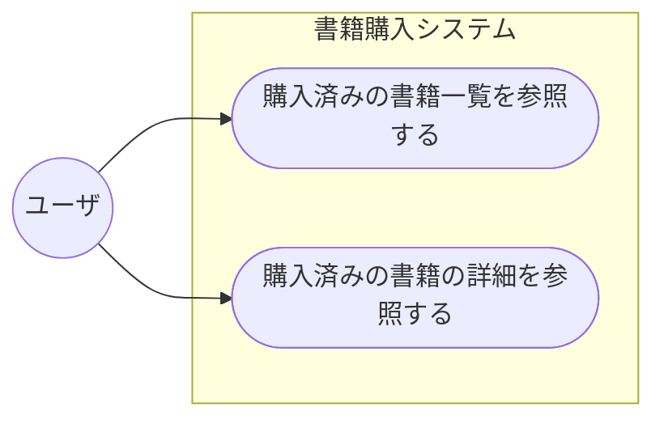

# 書籍管理システム

## 仕様

サンプルシステム2として「書籍管理システム」の以下の機能を実装する。

ユースケース図：

### 画面仕様

- [一覧画面（ダミーデータ）](./public/booklist.html)
- [一覧画面（ダミーデータ）](./public/booklist.html)

### 機能仕様

- [サンプルシステム2 仕様](./docs/requirement_samplesystem2.md)

## ディレクトリ・ファイル構成

以下のファイルを使用して実装する。

| ディレクトリ名・ファイル名 | 内容 |
|:--|:--|
| `docs/` | ドキュメントディレクトリ |
| `docs/requirement_samplesystem2.md` | サンプルシステム2(書籍管理システム)の仕様 |
| `docs/how_to_setup_sqlite3_for_samplesystem2.pdf` | サンプルシステム2(書籍管理システム)のDBをSQLite3を使ってセットアップする手順 |
| `data/` | データディレクトリ |
| `data/booklist.sqlite3` | SQLite3 書籍管理システムデータ格納済みデータベースファイル |
| `data/books.csv` | CSV/UTF-8形式の books テーブルデータファイル |
| `data/orders.csv` | CSV/UTF-8形式の orders テーブルデータファイル |
| `data/employees.csv` | CSV/UTF-8形式の employees テーブルデータファイル |
| `public/` | 静的ファイル配置ディレクトリ |
| `public/booklist.html` | 一覧画面（ダミーデータ） |
| `public/bookdetail.html` | 詳細画面（ダミーデータ） |
| `public/css/` | CSSファイル配置ディレクトリ |
| `public/css/booklist.css` | 一覧画面用スタイルシート |
| `public/css/bookdetail.css` | 詳細画面用スタイルシート |
| `public/image/` | 画像ファイル配置ディレクトリ |
| `public/image/20220501_noimage.png` | イメージなし画像データ(フリー素材) |
| `public/image/curve12.png` | トップへ矢印アイコン画像データ |
| `public/image/stripe.png` | ストライプ背景用画像データ |
| `README.md` | このファイル |

